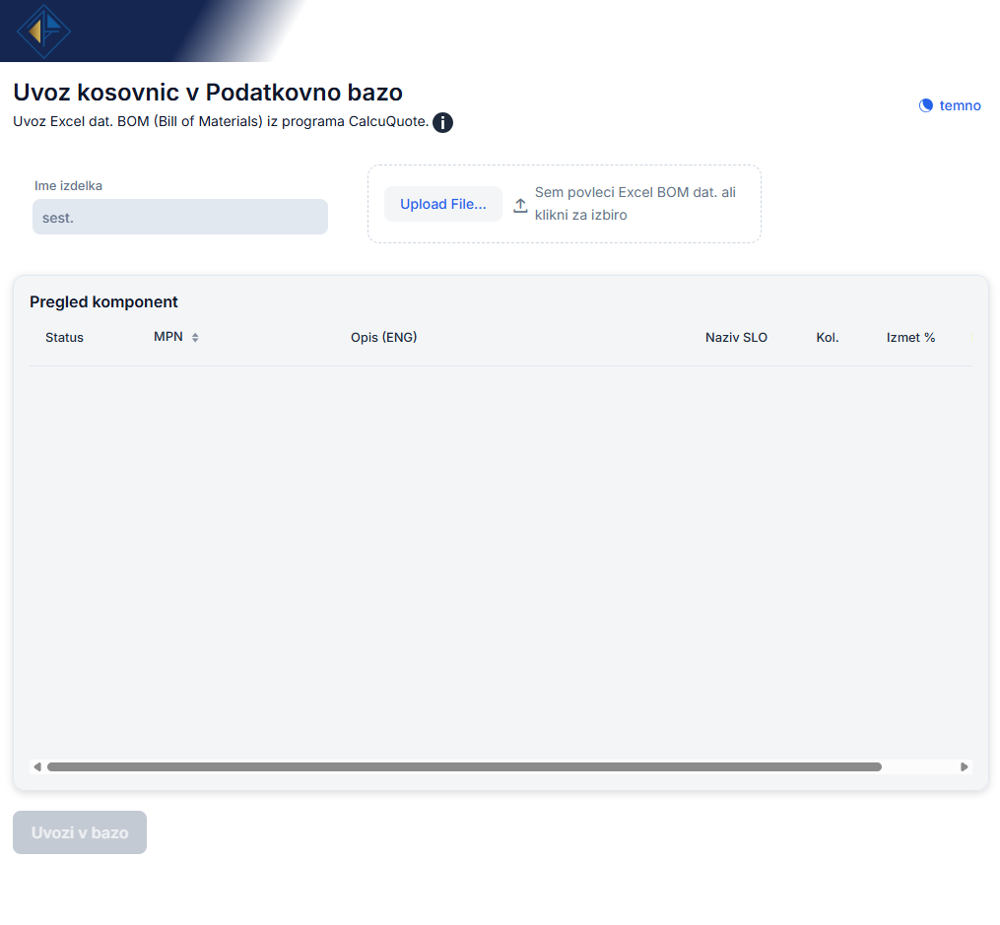
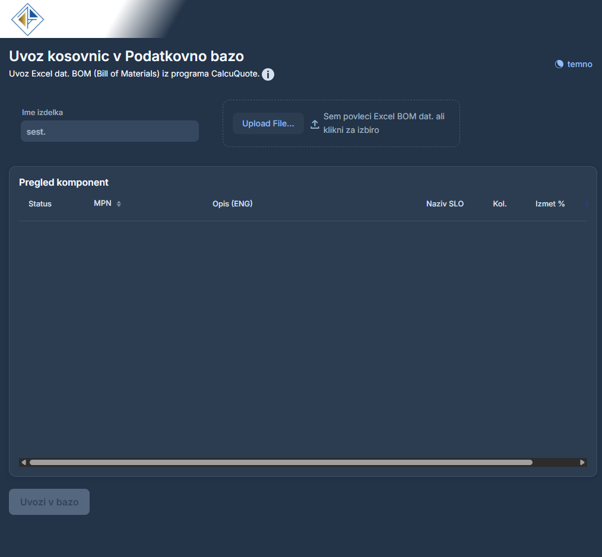
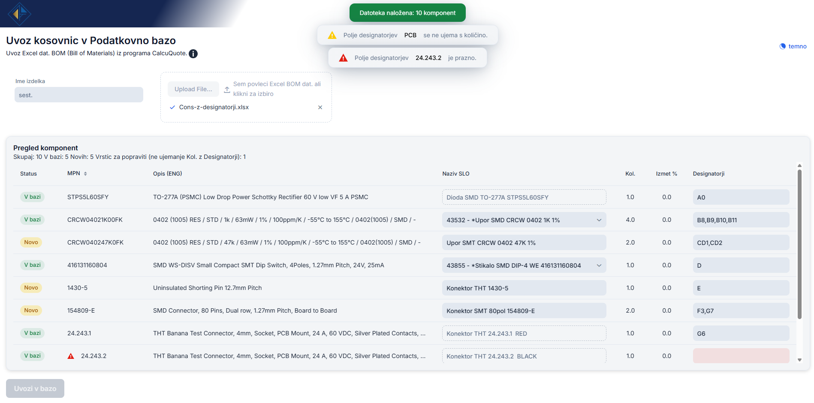

<a id="vrh"></a>
# BOM Import - into database

A internal web tool for importing Bills of Materials (BOM) from CalcuQuote Excel exports into the LARGO ERP database.
Built with Java 21, Spring Boot, Vaadin 25, and JPA/Hibernate connecting to Microsoft SQL Server.

 

## What it does

First, we need to have an .xlsx file in our file system obtained from CalcuQuote. It represents a Bill of Materials (BOM), and correctly named columns are crucial for the application to work properly. 

This application:
Parses the Excel file and extracts all components (MPN, description, quantity, designators, HTS code, etc.)
Then checks each component against the existing LARGO database, Auto-translates English component descriptions into Slovenian using pattern matching and lets the user review and fix translations and designators before importing.

On confirmation, writes everything to the database:

There it creates a new assembly article in MaticniPodatki, new component articles for any MPN not already in the DB
and then writes all BOM rows into the Kosovnica table.



## Getting Started

Those are instructions on setting up your project locally. To get a local copy up and running follow these simple steps.

### Requrements

 For all **Java/Maven** projects everything is **already defined** in `pom.xml`. Maven downloads all dependencies automatically when you `run mvn spring-boot:run`, so you just need to download theese manually.

- Java 21 (JDK, not just JRE)
- Maven
- Network access to the SQL Server (VPN or local)


### Setup

Clone this repository:

```git clone https://github.com/split-hue/BOM-to-DB.git```

Open `src/main/resources/application.properties` and fill in your DB credentials:

```
spring.datasource.url=jdbc:sqlserver://LUZNAR-2018\\LARGO;databaseName=LUZNAR_TESTNO_OKOLJE;encrypt=false;trustServerCertificate=true
spring.datasource.username=YOUR_USERNAME
spring.datasource.password=YOUR_PASSWORD
```
### Run

Make sure you are connected to the network (or VPN), then open the terminal in the root of the project (where `pom.xml` is) and run:

```mvn spring-boot:run```

Now open your browser at http://localhost:8080

## Project structure

```bash

src/main/java/com/ksenija/
│
├── Application.java                        - Spring Boot entry point
├── AppShell.java                           - Vaadin theme and PWA configuration
├── BomImportTest.java                      - integration test for BomService.importBom
│
├── ui/
│   └── MainView.java                       - Vaadin UI (upload, grid, import button)
│
├── service/
│   ├── BomService.java                     - DB check + full import logic (includes MPN lookup and deduplication)
│   └── TranslatorService.java              - English → Slovenian description translator
│
├── parser/
│   ├── ExcelParser.java                    - reads .xlsx, finds header row, builds column map
│   ├── ExcelColumnDefinition.java          - enum of expected Excel column names
│   └── BomItemMapper.java                  - maps Excel rows to BomItem, validates designators
│
├── model/
│   ├── BomItem.java                        - data object for one BOM component
│   ├── MaticniPodatek.java                 - JPA entity for MaticniPodatki table
│   └── Kosovnica.java                      - JPA entity for Kosovnica table
│
└── classification/
    ├── ClassificationService.java          - classifies components by type (resistor, capacitor, etc.)
    ├── ComponentDetector.java              - detects mounting type and package from description
    └── ComponentType.java                  - enum of all supported component types

```

### Generate `.jar` file
```bash
mvn clean package -DskipTests
```
It would skip the test file and your file is now created at `target/import_ksenija-1.0-SNAPSHOT.jar`. If having issues first double-click on 'maven' (right panel) > 'clean' and then again on 'maven' > 'target' to do the same thing. 

### Generate documentation
```bash
mvn javadoc:javadoc
```
Then open `target/site/apidocs/index.html` in your browser.


## Authors :rabbit:

<div align="center">
  <a href="https://github.com/split-hue">
    
    <br/>
    <b>@split-hue</b>
  </a>
</div>

<p align="right"><a href="#vrh">back to top</a></p>
